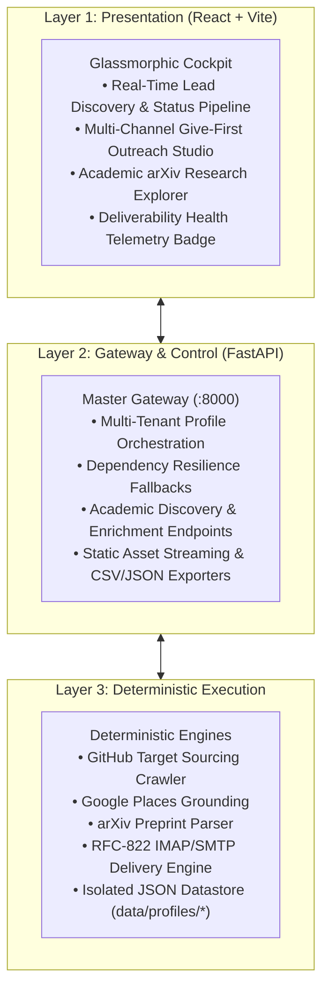

<p align="center">
  
</p>

# Aura Partner Research — Autonomous B2B Discovery & Outreach Cockpit

[](LICENSE)
[](https://www.python.org/)
[](https://fastapi.tiangolo.com/)
[](https://react.dev/)
[](https://vitejs.dev/)

Aura Partner Research is a high-density, multi-tenant B2B partner discovery, developer intelligence, and outreach platform. By unifying automated GitHub search crawlers, Google Places search grounding, academic preprint ingestion (arXiv), and LLM context synthesis with direct email deliverability monitoring, Aura enables teams to locate, analyze, and engage technical targets with high conversion authority.

---

## Visual Interface Preview

<p align="center">
  
</p>

---

## 3-Layer System Architecture



---

## Core Capabilities

- **Multi-Tenant Campaign Profiles**: Manage completely isolated campaigns. Switching profiles instantly changes ICP context, target repositories, draft histories, and email configurations.
- **Give-First Technical Authority**: Formulates outreach around concrete un-gatekept assets (Model Context Protocol servers, Parquet samples, or code templates) rather than generic sales pitches.
- **Academic Research Integration (arXiv)**: Query live preprints directly from the cockpit and 1-click enrich leads with technical citations.
- **Google Search Grounding & Email Resolution**: Automatically crawls local businesses and scrapes missing contact emails via Gemini Google Search Grounding.
- **Email Deliverability Circuit Breaker**: Evaluates DNS SPF/DMARC alignment, checks Spamhaus DBL blacklists in real time, monitors mailbox bounce rates, and automatically locks sending if health drops below 65%.
- **Direct Mailbox Draft Sync**: Creates RFC-822 drafts directly in **Gmail, Outlook/Office365, Yahoo, PrivateEmail, or Custom IMAP** folders for review before sending.
- **1-Click CSV/JSON Data Export**: Instantly export your qualified leads and enriched metadata to standard formats for team workflows.

---

## Quickstart (Zero to One)

### 1. Clone & Install
```bash
git clone https://github.com/MuzikayiseKhuzwayo/aura-research.git
cd aura-research

# Install frontend dependencies
npm install

# Install backend dependencies
pip install fastapi uvicorn google-genai pydantic
```

### 2. Configure Environment
```bash
cp .env.example .env
# Insert your GEMINI_API_KEY in .env (optional: runs in offline fallback mode if omitted)
```

### 3. Launch Development Cockpit
```bash
npm run dev
```

Open **`http://localhost:5173`** in your browser. The backend gateway runs concurrently on `http://127.0.0.1:8000`.

---

## Documentation (Diátaxis Framework)

The project documentation is organized strictly according to the **Diátaxis** documentation framework across four quadrants:

| Quadrant | Document | Description |
| :--- | :--- | :--- |
| **Tutorials** | [10-Minute Zero-to-One Quickstart](docs/tutorials/quickstart.md) | Step-by-step learning guide for first-time installation and execution. |
| **How-To Guides** | [Multi-Profile Campaigns](docs/how-to/multi-profile-campaigns.md) | Recipe for isolating B2B campaigns and refining custom ICP context. |
| **How-To Guides** | [Email Draft Sync & Deliverability](docs/how-to/email-draft-sync-and-deliverability.md) | Connecting mailboxes and understanding the deliverability safety lock. |
| **How-To Guides** | [Academic arXiv Enrichment](docs/how-to/academic-arxiv-enrichment.md) | Sourcing research preprints and enriching developer signals. |
| **Reference** | [API Specification](docs/reference/api-specification.md) | Complete machine-accurate REST endpoint contracts and schemas. |
| **Reference** | [Data Schemas & Storage](docs/reference/data-schemas-and-storage.md) | JSON database structure and TypeScript data interfaces. |
| **Reference** | [CLI Reference Guide](docs/reference/cli-reference.md) | Terminal commands for `pipeline.py`, `researcher.py`, and `start-dev.js`. |
| **Explanation** | [Architecture & Design Principles](docs/explanation/architecture-and-design-principles.md) | 3-layer architecture, Give-First philosophy, and fallback mechanics. |
| **Explanation** | [Deliverability & Safety Circuits](docs/explanation/deliverability-and-safety-circuits.md) | SPF/DMARC verification, Spamhaus DBL, and mailbox bounce mathematics. |

---

## Open Source Showcase

Visit our interactive [Product Showcase](showcase/index.html) for a simulated walkthrough of the Aura Partner Research cockpit, keyboard shortcuts, and live telemetry previews.

---

## Contributing

Contributions, bug reports, and pull requests are warmly welcomed! Please read our [CONTRIBUTING.md](CONTRIBUTING.md) for coding conventions, test execution, and pull request guidelines.

---

## License

Aura Partner Research is open-sourced under the **MIT License**. See [LICENSE](LICENSE) for full details.
