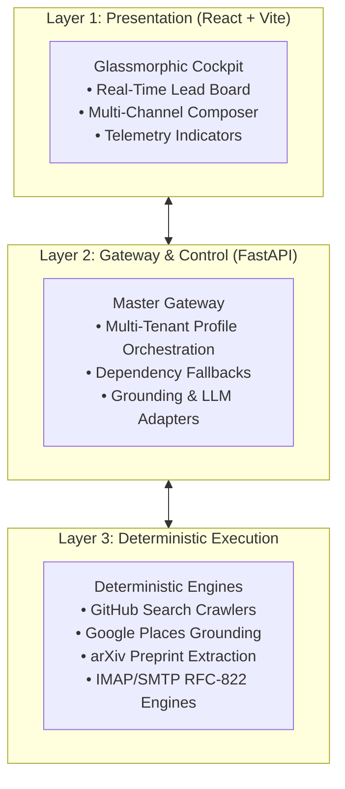

# Explanation: Architecture & Design Principles

Aura Partner Research is engineered to solve a fundamental problem in B2B technical outreach: **developer and researcher spam resistance**. High-value developers, quants, and founders reject automated marketing copy with near-total accuracy. 

Aura is architected around the **"Give-First" Technical Authority** paradigm.

---

## 1. The 3-Layer Separation of Concerns

### Layer 1: Presentation
- Written in React 19 + Vite 8.
- Enforces an ultra-low latency, glassmorphic dark-slate aesthetic.
- Zero external UI bloat; all SVG icons in `Icons.jsx` are compiled in-line to prevent ESM bundle failures or runtime CDN outages.

### Layer 2: Gateway & Control
- A unified FastAPI server running on Uvicorn.
- Serves as the central coordination layer between frontend UI actions, LLM providers, and file persistence.
- Implements **Graceful Dependency Fallbacks**: non-essential or heavyweight libraries (such as Google GenAI) are wrapped in import guards, allowing the entire platform to boot in offline/rule-based mode if credentials or connectivity are absent.

### Layer 3: Deterministic Execution
- Python-based crawlers and API interfaces (GitHub, Google Search Grounding, arXiv, IMAP/SMTP).
- Operates directly on the filesystem database with non-destructive merge algorithms, preserving CRM status changes, custom notes, and draft revisions across crawl updates.

---

## 2. Core Design Principles

### Principle 1: "Give-First" Value Formulation
Instead of asking for a 15-minute introductory call, cold communications must offer immediate, tangible assets:
- For AI/Web3 developers: Model Context Protocol (MCP) servers, API bridges, or micro-billing endpoints.
- For Quants and Hedge Funds: Clean Parquet data samples, orderbook reconstruction files, or backtesting scripts.

### Principle 2: Strict Constraint-Driven Prompting
Standard LLMs tend towards conversational fluff and sales clichés. Aura enforces strict algorithmic bounds on generated copy:
1. **Sentence Boundary**: Entire copy is restricted to strictly 3 to 4 sentences.
2. **Word Count Limit**: No individual sentence can exceed 20 words.
3. **Active Line Breaks**: A blank line is forced between every sentence to maximize scannability on mobile screens.
4. **Zero Fluff**: Greetings ("Hope this finds you well") and vendor pitches are completely forbidden.

### Principle 3: Non-Destructive Ingestion
When new targets are crawled from GitHub or Google Places, the system matches records against existing IDs. If a lead already exists:
- CRM status (`Ready`, `DM Drafted`, `Sent`, `Replied`) is permanently preserved.
- Custom notes and manually edited drafts are never overwritten.
- Missing communication channels are backfilled without erasing existing contact fields.
