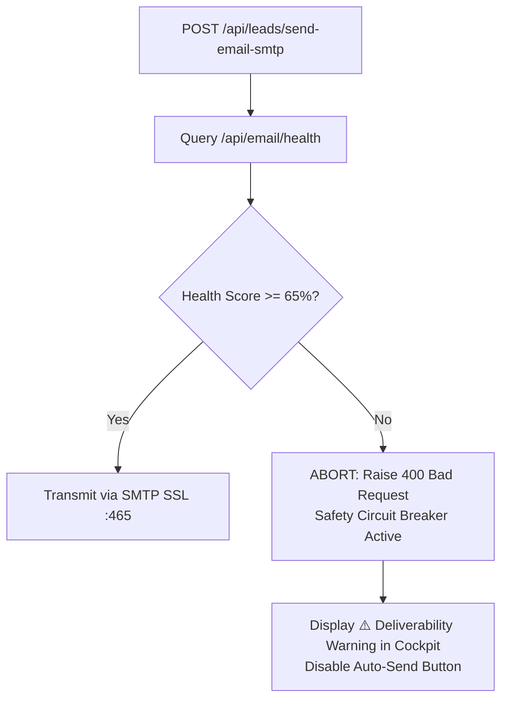

# Explanation: Deliverability Telemetry & Safety Circuit Breakers

Cold email delivery is subject to aggressive reputation scoring by major Mail Transfer Agents (Google Workspace, Microsoft 365, Proofpoint, Mimecast). Sending high volumes with misconfigured DNS or to invalid addresses burns domain reputation within days.

Aura implements an automated **Deliverability Health Analyzer and Safety Circuit Breaker** to protect user domains from irrecoverable sender penalties.

---

## 1. Deliverability Scoring Model

Aura evaluates sending health via a composite formula weighting four vectors:

$$\text{Health Score} = 100 - \Delta_{\text{SPF}} - \Delta_{\text{DMARC}} - \Delta_{\text{Blacklist}} - \Delta_{\text{Bounces}}$$

| Vector | Penalty Weight | Diagnostic Method |
| :--- | :--- | :--- |
| **SPF Record Missing / Invalid** | $-25\%$ | Active DNS `TXT` query verifying `v=spf1` record exists and includes the current SMTP relay server. |
| **DMARC Policy Missing / Invalid** | $-20\%$ | Active DNS `TXT` query on `_dmarc.<domain>` checking for `p=none`, `p=quarantine`, or `p=reject`. |
| **Spamhaus DBL Blacklisted** | $-50\%$ | DNS resolution against `dbl.spamhaus.org`. If the domain resolves to `127.0.1.x`, a critical blacklist event is registered. |
| **Mailbox Bounce Penalty** | $-5\%$ per bounce (up to $-30\%$) | IMAP query scanning messages over the trailing 7 days from `mailer-daemon` or `postmaster`. |

---

## 2. Safety Circuit Breaker Mechanics

### Why 65%?
Major email inbox providers apply aggressive algorithmic throttling once a domain's bounce rate exceeds 2-3% or if SPF/DMARC alignment fails. An operational score below 65% indicates a catastrophic configuration error (e.g. blacklisted domain or total lack of SPF authorization).

By programmatically intercepting and rejecting SMTP dispatch requests before packets leave the machine, Aura prevents mailbox providers from marking your IP or domain as a malicious spammer.
