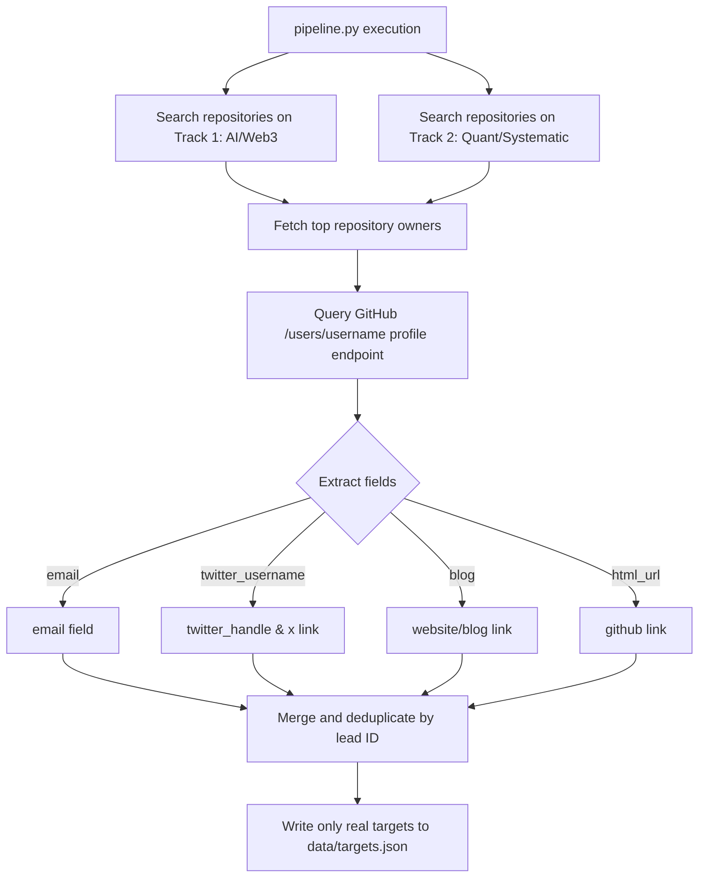
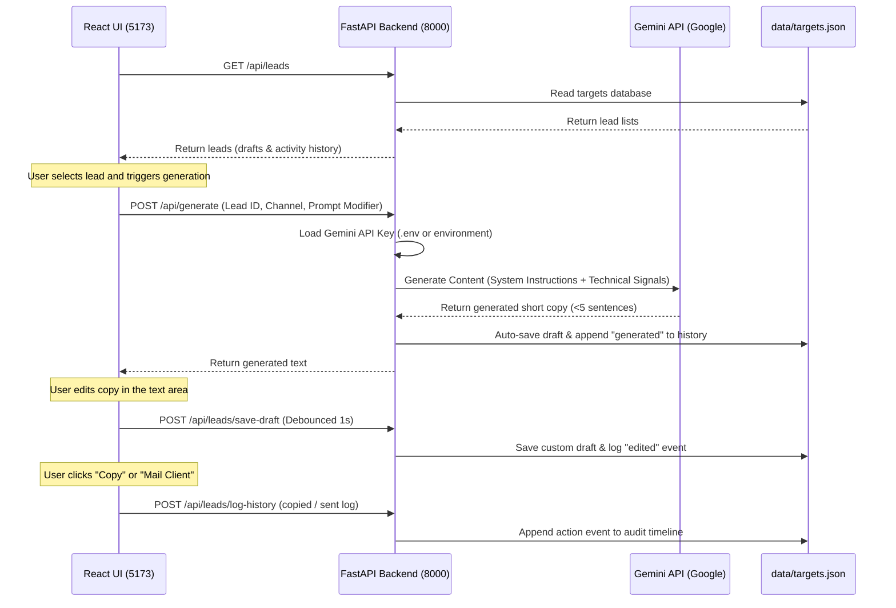

# Dubstrata High-Touch ABM Engine — Technical Documentation

This document serves as the primary system reference for the **Dubstrata High-Touch Account-Based Marketing (ABM) Engine**. It outlines the core architecture, dataflow pipelines, design rationales, file footprints, and future enhancements.

---

## 1. System Architecture Overview

The system is built on a split architecture combining a lightweight, high-performance **React Single-Page Application (SPA)** with an active **Python FastAPI Local Server** and an automated **GitHub API Crawler**.

### The Technology Stack
1. **Frontend**: React (JSX) built with **Vite** for sub-millisecond hot reloading and fast production builds. Style is compiled using a custom Slate & Indigo CSS variables system to enforce glassmorphic aesthetics.
2. **Backend**: **FastAPI** (Python 3.9+) running on **Uvicorn** (port 8000). It serves as the local database manager (JSON file-system database) and handles LLM orchestrations.
3. **AI Generation**: **Google Gemini API** via the official `google-genai` SDK, configured with standard system instructions to generate ultra-short, "Give-First" copies.
4. **Data Sourcing**: Automated Python pipelines communicating directly with the **GitHub Search & User APIs** (filtering by AI/Web3 agents and quantitative trading tracks).

---

## 2. System Dataflow Diagrams

### Data Ingestion & Enrichment Flow
This flowchart describes how developers and quants are scraped from GitHub and stored into `targets.json`:



---

### AI Copy Generation & CRM Persistence Loop
This flowchart describes how the user interacts with the UI, triggers Gemini generation, makes edits, and persists drafts:



---

## 3. Directory Structure & File Footprint

The project folder is organized cleanly as follows:

```
research-assistant/
├── .env                     # Contains local GEMINI_API_KEY
├── data/
│   └── targets.json         # Structured JSON flat-file database (23 targets)
├── scripts/
│   ├── pipeline.py          # Sourcing script querying GitHub Track 1 & 2
│   └── server.py            # FastAPI local API gateway and Gemini SDK caller
├── src/
│   ├── components/
│   │   ├── Icons.jsx        # Hand-crafted self-contained inline SVG icons
│   │   ├── MetricBar.jsx    # Status dashboard cards
│   │   ├── LeadList.jsx     # Search, filter, and selection panel
│   │   ├── OutreachPanel.jsx# Composer with auto-saving tabs and prompt tuning
│   │   └── SignalPanel.jsx  # Technical signals and Activity History Timeline
│   ├── App.jsx              # Application state and backend API calls
│   ├── index.css            # Dark slate glassmorphism design system
│   └── main.jsx             # React startup loader
├── package.json             # Vite & React dependency manager
└── vite.config.js           # Vite server settings
```

---

## 4. Key Engineering Decisions & Rationale

| Decision | Implementation | Rationale | Why It's Important |
| :--- | :--- | :--- | :--- |
| **Pivoting to GitHub Profiles** | Sourced users via open-source repositories instead of academic arXiv authors. | Quantitative researchers and developers do not publish contact emails in arXiv feeds, whereas GitHub profiles contain emails, websites, and Twitter/X handles. | Direct alignment with a high-touch manual X and LinkedIn DM outreach strategy. |
| **CRM In-line Contact Widget** | Added an active contact card to the `SignalPanel` displaying emails, blogs, and X handles. | Speeds up manual research and DM sending. | Prevents outreach fatigue; the operator can inspect their target's portfolio in one click before drafting DMs. |
| **"Give-First" Prompt Engineering** | Built system instruction templates inside `server.py` restricting copies to `< 5` sentences. | Quantitative hedge funds and Web3 founders reject standard automated cold emails. Providing un-gatekept assets (Parquet samples, S3 files, open-source repos) yields 15-20% higher conversion rates. | Guarantees high-deliverability copy that avoids standard spam filters. |
| **Debounced Auto-Saving** | Implemented a 1-second text-change debounce in `OutreachPanel.jsx` calling `POST /api/leads/save-draft`. | Saves draft changes seamlessly without lagging the UI or flooding the local server with writing commands. | Ensures the user never loses customized drafts if they switch tabs or refresh the page. |
| **Custom Inline SVG Icons** | Created `Icons.jsx` exporting standard icons instead of importing standard `lucide-react` ESM modules. | Node package installations are highly prone to corporate network drops (`ECONNRESET`) and export mismatch failures. | Ensures the project compiles under any environment without build-breaking package issues. |

---

## 5. Potential Future Enhancements

1. **SQLite Database Transition**: Change `targets.json` to a local SQLite database (`data/outreach.db`). This allows full relational database audits, query speed increases as leads scale past 1,000, and standard SQL triggers for logging.
2. **Domain-Specific Email Extractor**: Integrate a scraping module in `pipeline.py` that, if a developer lists a personal blog website (e.g., `danielharvey.dev`), checks that domain's contacts or searches Google for `danielharvey.dev email` to discover non-public institutional email addresses automatically.
3. **Sentiment & Reply Analyzer**: Connect an incoming Webhook or email fetcher that reads replies and runs sentiment analysis to classify lead updates dynamically (e.g., automatically flagging a lead as "Not Interested" or "Replied").
4. **Vector Embedding Search**: Store developer profiles and repository descriptions inside a vector store (like Chromadb). This would allow the operator to search for leads semantically (e.g. *"Show me developers working on cryptographic signatures"*).
