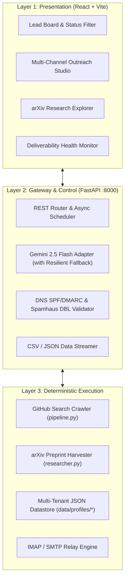

# Aura Partner Research — System Documentation Index

This document serves as an architectural bridge. In accordance with the **Diátaxis documentation framework**, the primary system documentation is partitioned into four distinct quadrants under the [`docs/`](docs/) directory:

---

## Canonical Documentation Quadrants

1. **Tutorials (Learning-Oriented)**
   - [10-Minute Zero-to-One Quickstart](docs/tutorials/quickstart.md): Step-by-step setup guide for developers.

2. **How-To Guides (Problem-Oriented)**
   - [Multi-Profile Campaign Management](docs/how-to/multi-profile-campaigns.md): Isolating tenant data and configuring ICP context.
   - [Email Draft Sync & Deliverability Circuit Breaker](docs/how-to/email-draft-sync-and-deliverability.md): Connecting mailboxes and understanding the health lockout.
   - [Academic arXiv Preprint Enrichment](docs/how-to/academic-arxiv-enrichment.md): Searching academic papers and attaching citations.

3. **Reference (Information-Oriented)**
   - [API Specification](docs/reference/api-specification.md): Machine-accurate REST endpoints, request payloads, and response models.
   - [Data Schemas & Persistence Model](docs/reference/data-schemas-and-storage.md): JSON flat-file storage layouts and TypeScript interfaces.
   - [CLI Reference Guide](docs/reference/cli-reference.md): Command-line flags and parameters for `pipeline.py`, `researcher.py`, and `start-dev.js`.

4. **Explanation (Understanding-Oriented)**
   - [Architecture & Design Principles](docs/explanation/architecture-and-design-principles.md): The 3-layer architecture, Give-First technical authority, and dependency resilience.
   - [Deliverability Telemetry & Safety Circuits](docs/explanation/deliverability-and-safety-circuits.md): SPF/DMARC resolution, Spamhaus DBL, and bounce rate scoring.

---

## System Overview Diagram

```mermaid
flowchart TD
    subgraph UI ["Layer 1: Presentation (React + Vite)"]
        LeadList["Lead Board & Status Filter"]
        Composer["Multi-Channel Outreach Studio"]
        ArxivModal["arXiv Research Explorer"]
        Telemetry["Deliverability Health Monitor"]
    end

    subgraph API ["Layer 2: Gateway & Control (FastAPI :8000)"]
        MasterRouter["REST Router & Async Scheduler"]
        AI_Client["Gemini 2.5 Flash Adapter (with Resilient Fallback)"]
        HealthChecker["DNS SPF/DMARC & Spamhaus DBL Validator"]
        Exporter["CSV / JSON Data Streamer"]
    end

    subgraph Storage ["Layer 3: Deterministic Execution"]
        GH_Crawler["GitHub Search Crawler (pipeline.py)"]
        Arxiv_Parser["arXiv Preprint Harvester (researcher.py)"]
        DB["Multi-Tenant JSON Datastore (data/profiles/*)"]
        Mailer["IMAP / SMTP Relay Engine"]
    end

    UI <--> API
    API <--> Storage
```
